## 结合 figma 开发一个小程序
以前我们会想：给到设计稿，我们是否可以根据设计稿生成一个小程序出来，现在我们就可以实现，主要是通过mcp，可以让ai了解页面结构，完成页面开发。

接下来我们将通过一个示例，开发一个决策小程序，让大家了解如何通过cursor + figma 完成小程序的开发。

> 如未阅读 cursor 入门教程，前先阅读。

### 启动 figma 的mcp
```shell
# clone 项目
git clone https://github.com/GLips/Figma-Context-MCP.git
# 安装依赖 注意如果安装失败就更新node版本
npm install 
# 启动服务
npx figma-developer-mcp --figma-api-key=自己申请一下
```

启动成功展示：
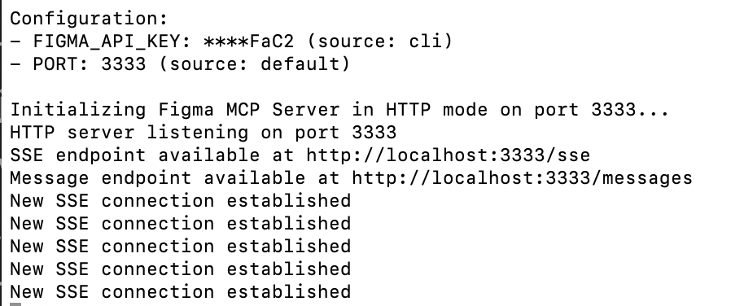

### 配置 mcp
在 cursor-setting -- MCP -- Add MCP Server 配置
type 选择 sse，server URL 填刚启动成功的本地连接：http://localhost:3333/sse
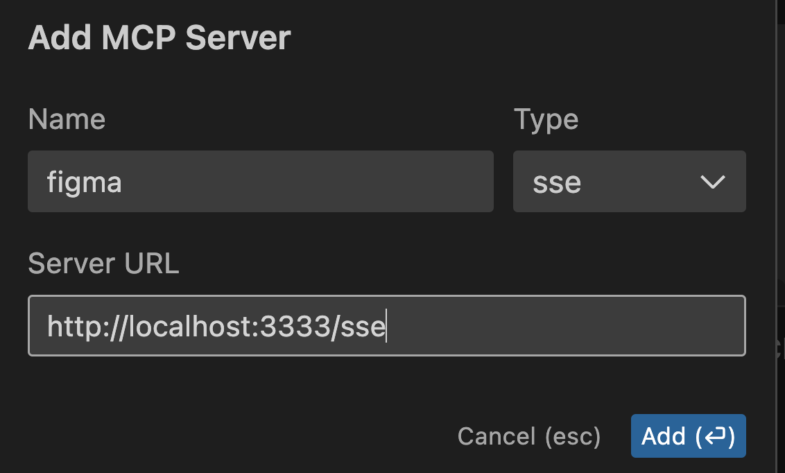

### clone 叮咚决策小程序设计稿

https://www.figma.com/community/file/1002882033791695129


在我们自己figma 打开项目，点击左边侧栏的界面，就可以看到页面设计稿
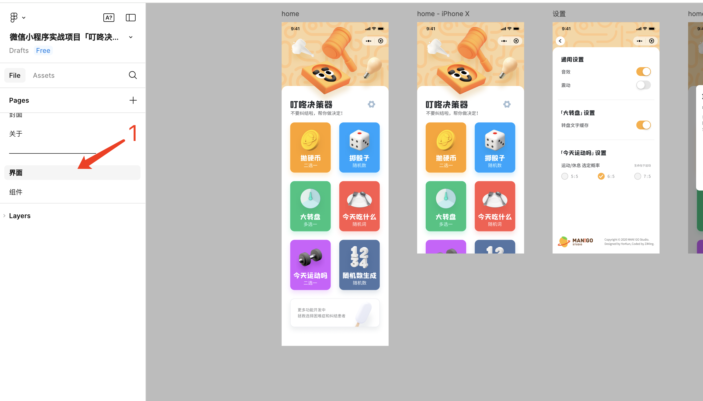

### 新增小程序根文件夹
```shell
mkdir make-decision
cd make-decision
# 用cursor 打开
code .
```
打开效果如下图：
只是一个空文件，右侧是一个chat框
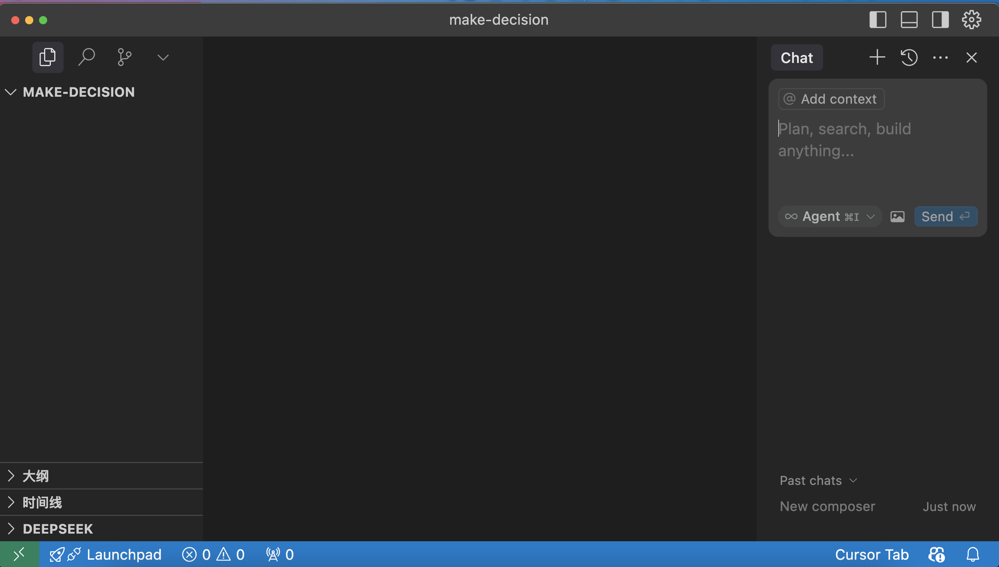

### 在 figma 中复制设计稿链接

在 figma 中选择页面图层，复制链接

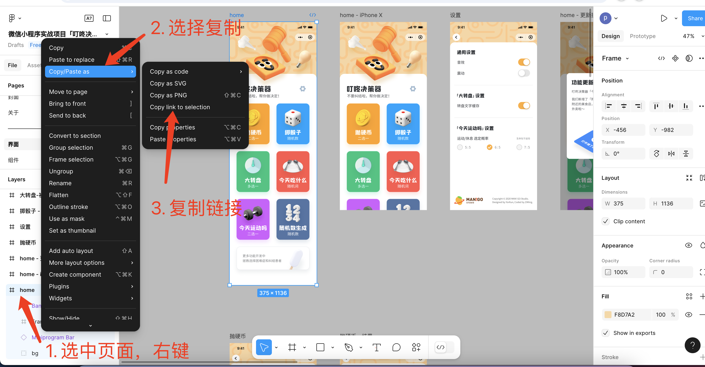

### 让 cursor 根据 figma 链接生成页面

1. 选择 agent 模式，模型选择claude-3.7-sonnet 不要选择gpt gpt 不操作文件
2. 粘贴 figma 链接
3. 提出要求 根据设计稿生成什么代码

示例提示词：
```text
请根据设计稿帮我生成一个小程序页面，页面功能暂时不用实现，使用到的图片资源需要从从figma中下载，像素单位要用rpx，适配多种机型
```

这里要注意：
1. figma mcp 要处于可用状态
2. 链接一次不要放多个 容易失败 
3. 对于要求要仔细 比如 px单位怎样转换，需要兼容多种机型
4. 每个页面可以先按照页面展示先实现，后面再补充页面功能，不要一下子让ai做太多的事

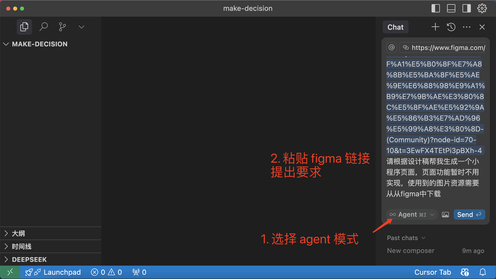

如有遇到超时，则检查figma mcp 状态
绿点表示正常
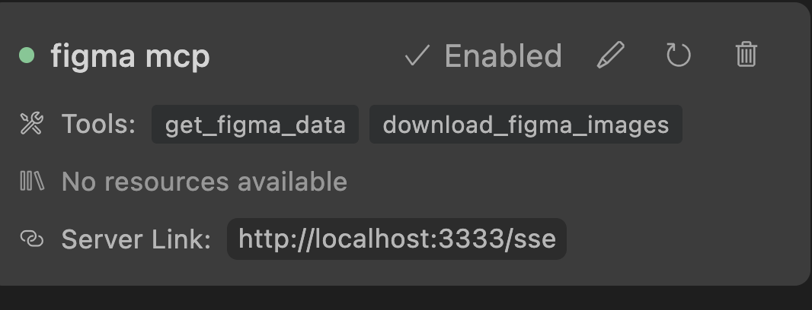

### 初步效果
首次渲染效果，看上去样式还有些需要调整的地方，但是页面结构是正确的
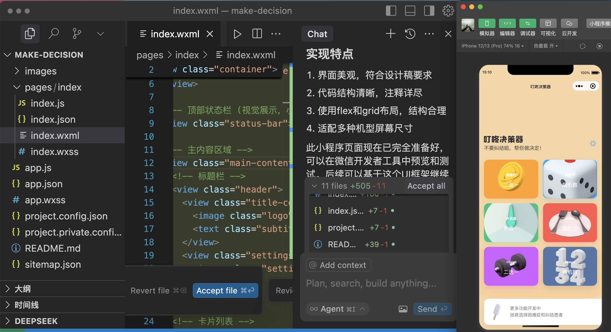

### 二次优化

对生成的结果有意见，则告诉cursor哪里有问题，并进行优化。
```text
卡片的背景图片展示不正确，请对比设计稿检查，如果是图片尺寸有问题则优化图片重新下载，如果是页面结构有问题，则优化页面结构
```
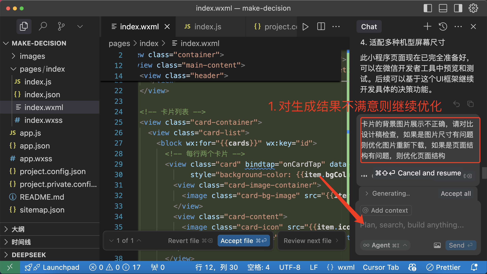

### 优化效果

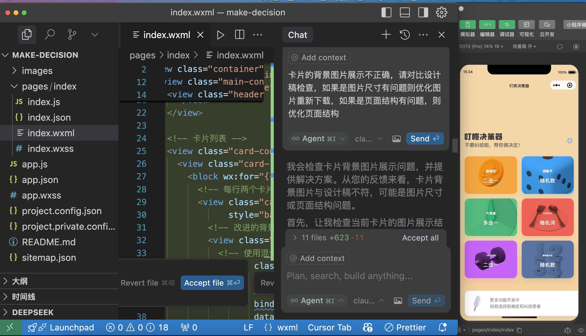


对比效果还是有优化的，虽然和原有结构不太一致 但是比第一次好，虽然不知道还能优化到什么程度，但是到这一步也很不错了，剩下的可以自己微调一下也行了。

### 增加一个功能页面
主界面有了，那我想增加一个新的抛硬币页面怎么办？
1. 选择 app.json 文件
2. 新开一个聊天框，不要在原有聊天框提问
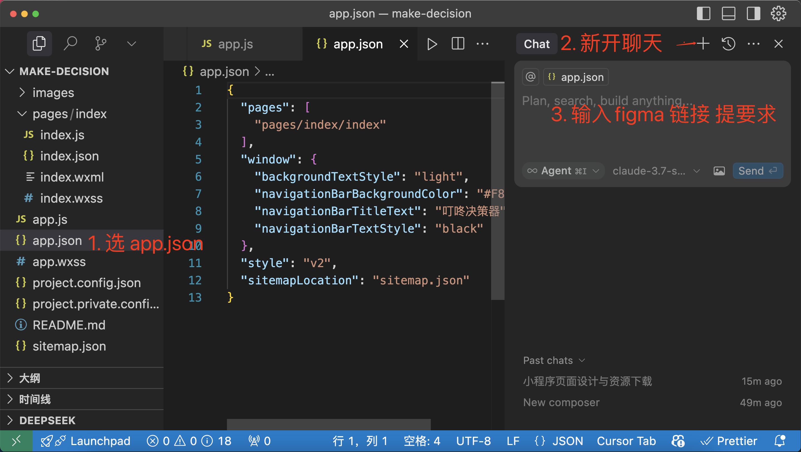
3. 输入设计稿链接
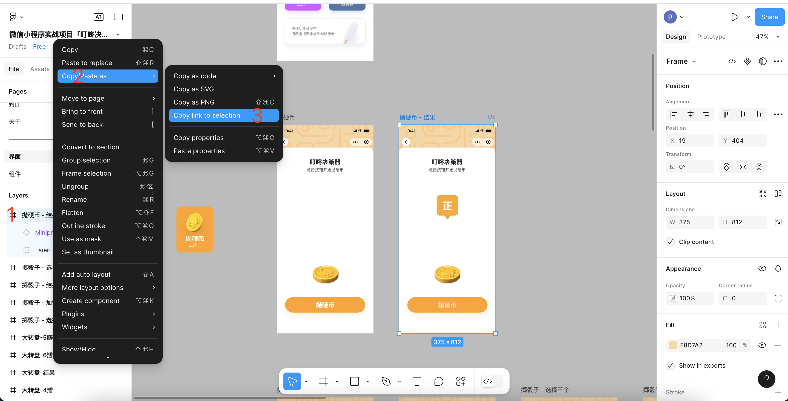
4. 提出要求
```text
帮我新增一个抛硬币的页面，并实现页面功能，如果需要图片资源优先从figma下载
```
最终cursor界面如下：
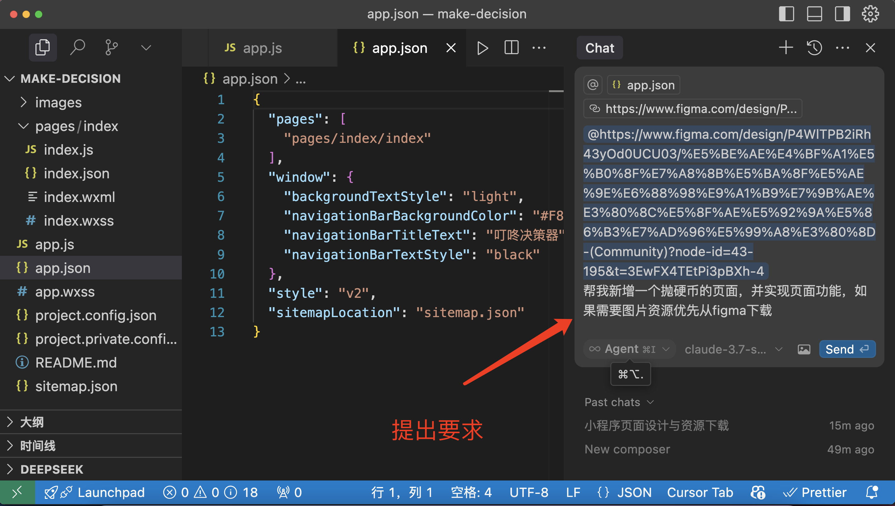

生成页面效果：
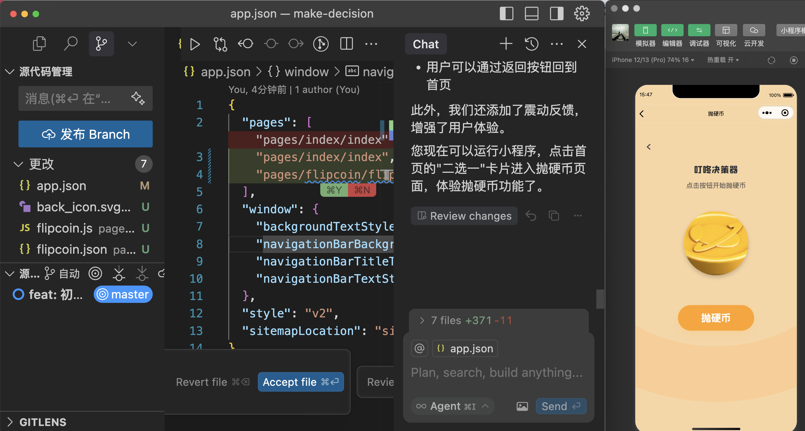

也有一定的功能，样式上还需要小调整。
如果还要再优化，也可以继续给cursor提要求。

### 效果对比
主页对比：


掷硬币页面对比：
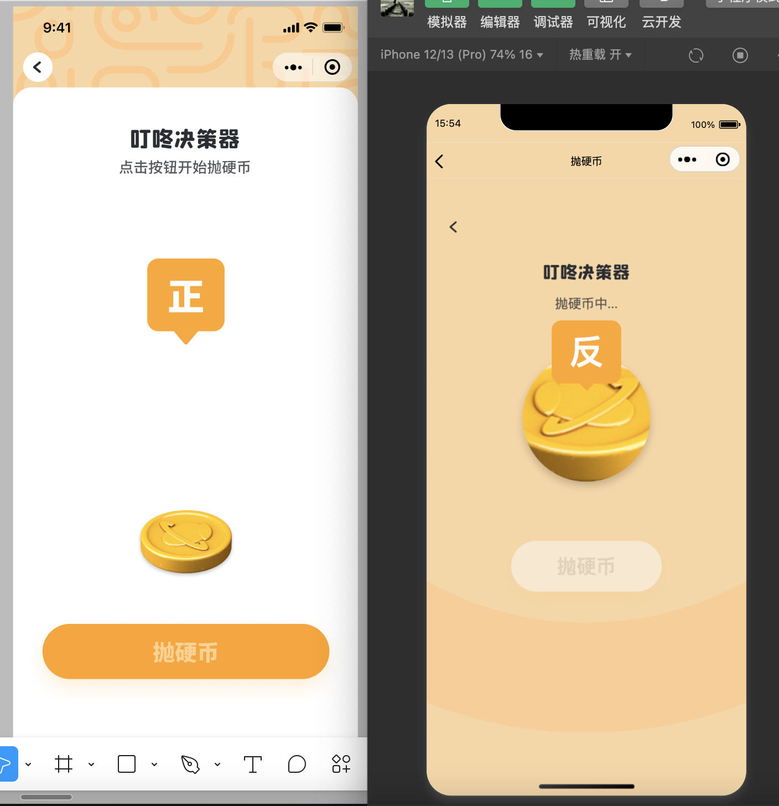