## 背景

随着各种工具的发展， AI 编程已经从好不好用的争论编程了，用哪个好，怎么用的争论，说明 AI 编程实际上已经成为程序开发中无法跳过的一个部分，不管是对于年轻的程序员还是经验丰富的程序员，尽快拥抱 AI 编程才是正确的道理，本教程就是从 cursor 的基础操作到高级功能，到更详细的最佳实践和案例，说明如何正确的时候 AI 编程，来达到我们的将本增效的期望，把程序员从搬砖中抽离出来，去完成更多具有创意性的工作。

## 下载安装

在 https://www.cursor.com/ 官网进行下载，下载后安装，目前最新的版本是 0.46.* ，带来了许多新的功能，比如：
- UI 更新，将 Agent 作为默认界面
- MCP 工具改进

官网课鞥没有提供 0.46 版本的下载，需要通过其他渠道下载，比如：
windows: https://anysphere-binaries.s3.us-east-1.amazonaws.com/production/aff57e1d9a74ed627fb5bd393e347079514436a7/win32/x64/user-setup/CursorUserSetup-x64-0.46.0.exe
mac(intel): https://anysphere-binaries.s3.us-east-1.amazonaws.com/production/aff57e1d9a74ed627fb5bd393e347079514436a7/darwin/x64/Cursor-darwin-x64.zip
mac(apple): https://anysphere-binaries.s3.us-east-1.amazonaws.com/production/aff57e1d9a74ed627fb5bd393e347079514436a7/darwin/arm64/Cursor-darwin-arm64.zip


## 从 VS Code 迁移

Cursor 本质上是 VS Code 开源版本的分支，所以可以非常简单的进行迁移，可以通过一键导入将 VS Code 配置导入到 Cursor 中。进入 Cursor 设置 > 常规 > 账户。

Cursor 没有用插件的方式来扩展 VS Code ，是为了Cursor 可以更好地控制编辑器的 UI，从而实现更深度的 AI 集成。像 Cursor Tab 和 CMD-K 这样的功能，作为现有编程环境中的插件是无法实现的。


⚠️ 需要注意的是，Cursor 本身没有自动同步插件的功能，所以如果你有在不同设备上使用 Cursor ，最好的办法是在安装插件的时候，去 vscode 的插件市场安装。这样在不同设备上使用 Cursor 的时候，就可以先安装 vscode 并同步插件，然后就可以在 Cursor 中使用这些插件了。


## private mode


cursor 支持开启隐私模式,启用**`隐私模式`**后，Cursor 或任何第三方将永远不会存储您的任何代码。否则，可能会收集提示、代码片段和遥测数据以改进 Cursor。

可以在载入时或在 **`Cursor Settings`** > **`General`** > **`Privacy Mode（常规`**）下启用**`隐私模式`**。


## Tab 自动补全

注册登陆成功之后，我们可以创建一个 `index.js` 文件，**然后输入注释**

```jsx
// 快速排序算法

```

然后回车，cursor 就会在下一行自动用灰色补全出函数名称，此时按下 tab

cursor 就会自动补全出完整的快速排序算法代码。这个功能不仅支持算法，还支持各种常见的代码片段和函数实现。你可以通过继续输入注释来让 cursor 生成更多的代码。


按下 tab 之后，cursor 则会继续展示剩余可以补全的部分

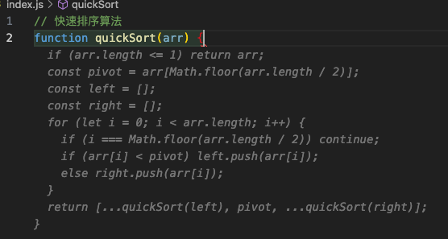

只需要再次按下 tab 就可以写完整个函数了

Tab 补全功能是平时使用的最多的功能，可以大大提高编码效率。需要注意的是 Tab 补全使用的是 cursor 自研的模型，而非其他大语言模型，所以容易出现错误。但是相对来说，响应的效率更高，所以如果补全出现错误，不妨调用其他大语言模型来修复。

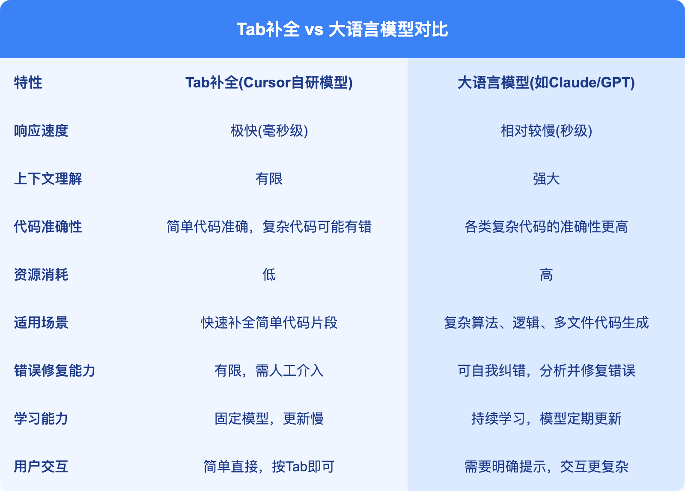


### 上下文感知能力

在使用 Cursor 时，Tab 补全功能具有强大的上下文感知能力。它会自动分析最近打开和使用过的文件内容作为上下文参考，并且支持跨文件的智能理解。如果你需要基于其他文件中的代码、类或函数进行补全，只需先打开这些相关文件，Cursor 就会将它们纳入上下文范围，从而提供更准确的 Tab 补全建议。这种上下文感知机制使得在复杂项目中的代码编写更加高效和连贯。

### 使用 ctrl/command + → 逐字接受补全

在使用自动补全时，有时我们可能只需要部分建议内容，而不是全部接受。此时，可以使用 ctrl/command + → 快捷键来逐字接受补全内容。这个功能允许你一个字符一个字符地确认补全建议，从而精确控制要采纳的内容范围。

这种方法特别适合以下情况：
- 当补全建议部分正确时
- 需要对生成内容进行微调时
- 想要在接受过程中思考代码逻辑时

### 关闭注释补全

默认情况下，Cursor 在你编写注释时也会提供自动补全功能，这有时可能会干扰你的注释编写流程。如果你希望关闭这一功能，可以通过以下步骤操作：进入 **`Cursor Settings`** > `Features` > `Cursor Tab`，然后取消勾选"Suggestions in comments"选项。这样就可以在保留代码补全的同时，避免在编写注释时出现不必要的补全建议。

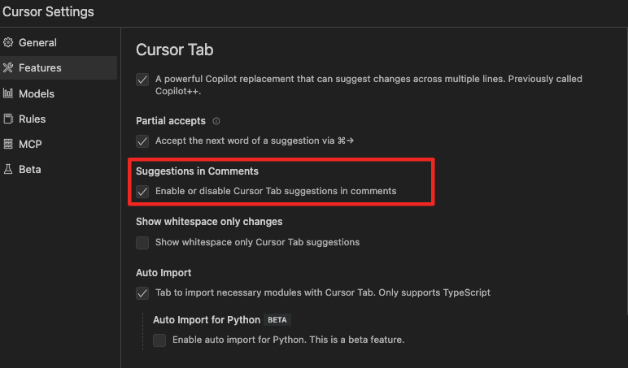

### 在速览中使用 Tab

在速览中使用 Tab 补全是非常方便且强大的功能，当我们在函数名上按下 F12 时，可以快速跳转到所有使用这个函数的地方，我们称之为「速览」，在速览中，Tab 功能同样是生效的，我们可以利用这个特性，快速修改函数及使用位置的参数。

例如，我们有一个 add 函数，将两个参数相加，我们想改成三个参数相加

```jsx
// 加法
function add(a, b) {
  return a + b;
}

改为
// 加法
function add(a, b, c) {
  return a + b + c;
}

```

此时按下 F12 ，并跳转到使用的位置

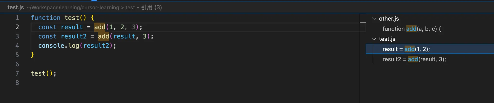

可以看到，已经自动帮我们补全了第三个参数

这里的基本原理在于 cursor tab 的上下文包含了我们最近的修改和访问的函数，所以如果我们刚修改完函数，此时到任何使用该函数的地方都可以快速补全对应的修改。


## 快速编辑功能 (Command + K)

通过选中代码块（如整个函数），然后按下 Command + K 快捷键，你可以激活 Cursor 的快速编辑弹窗。在弹窗中输入你的编辑需求，AI 将智能地修改你选中的代码部分。

> 注意：Command + K 只会处理被选中的代码部分，因此确保完整选中需要修改的函数或代码块非常重要。

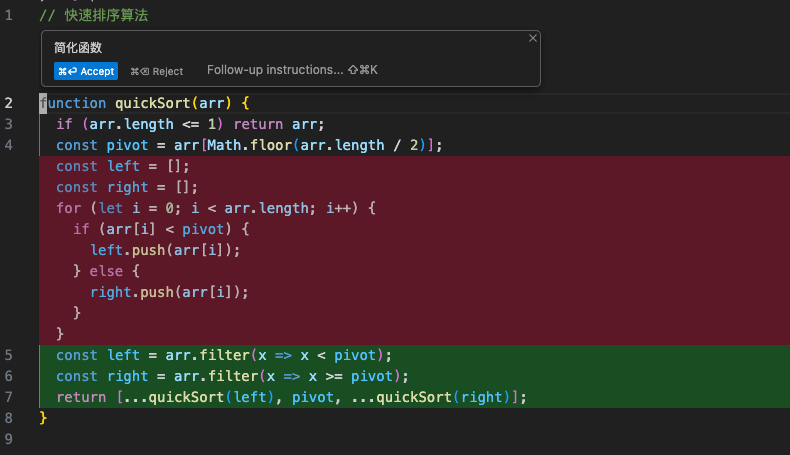

如图所示，Cursor 帮助我们优化了函数写法。你可以通过以下方式应用或取消修改：
- 点击 Accept 按钮或使用 Command + Enter 快捷键接受修改
- 使用 Command + Backspace 快捷键取消修改

如果没有选中任何代码，则默认会新增代码

### Command+K 快速提问

除了编辑代码，我们还可以快速向 AI 提问。在使用 `Command+K` 打开快速编辑弹窗后，按下 `Option+Enter` 组合键即可切换到提问模式。

这种模式下，AI 会给出对代码的解释和分析，而不会修改代码。这对于理解复杂代码逻辑或学习新的编程概念特别有帮助，可以大大提高开发效率。

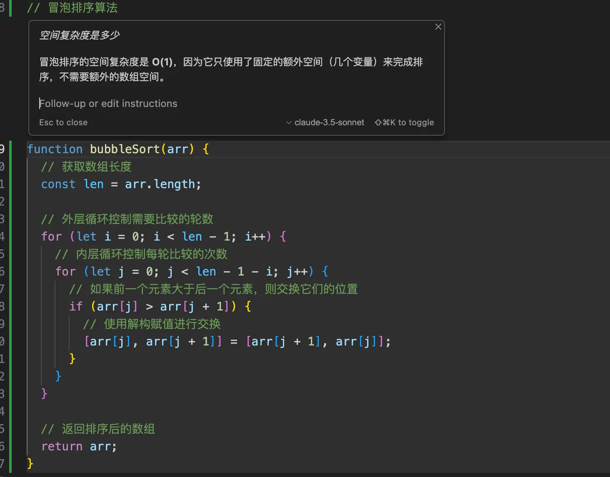

## Chat

我们可以用 `cmd + L` 打开聊天框，来向 AI 询问关于代码的问题，或者直接当作助手聊天


`cmd + L` 会默认将当前编辑文件作为上下文，也可以选择其他文件作为上下文

### 添加上下文

在聊天框中，我们可以添加不同的上下文，来帮助 AI 更好地理解我们的需求

这里我们只做一个简单的介绍，如果需要更详细的了解，可以参考 [Cursor 官方文档](https://docs.cursor.com/context/@-symbols/overview)，后面会对经常用到的再详细的说明

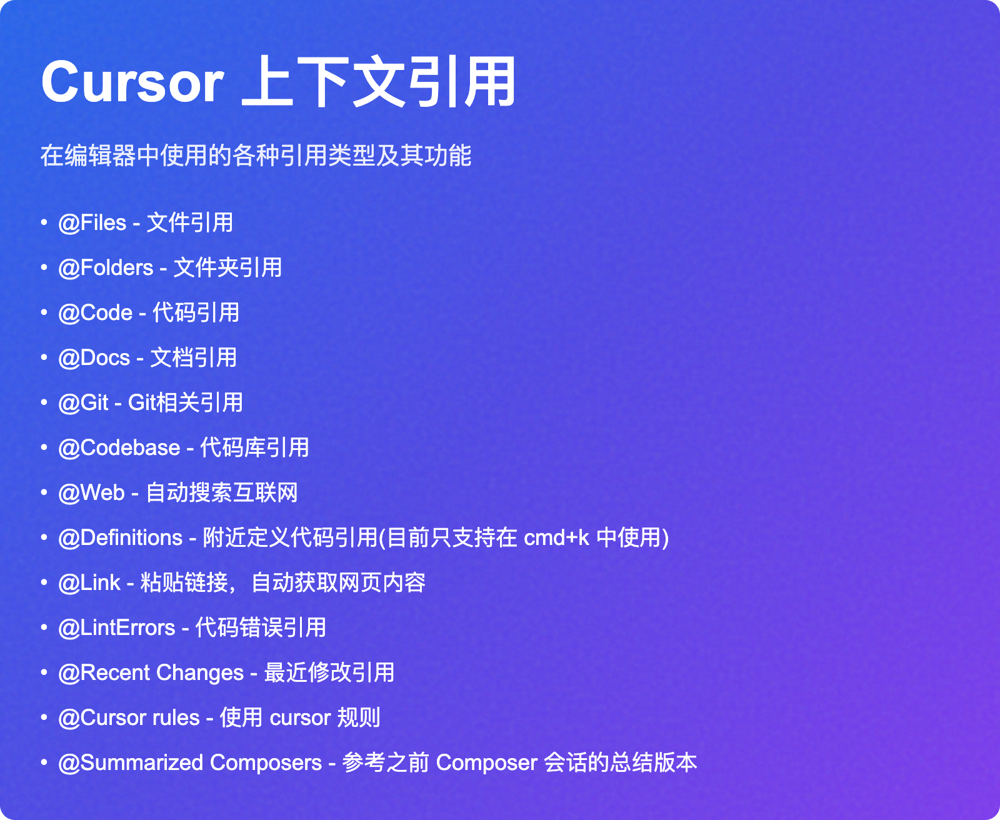


### 使用AI修复代码

当代码出现错误时，Cursor提供了多种AI辅助修复方式：

1. **悬停修复**：将鼠标悬停在报错位置，会出现选项：
   - **Fix in Chat**：在聊天界面中分析错误并自动修复，现在会自动选择 Agent 模式来修复代码错误
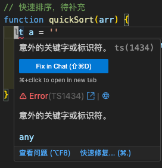

2. **快捷键修复**：在错误代码所在行按下`command/ctrl + .`，选择「Fix with AI」选项，这将调用快速编辑功能修复代码。这种方式无需打开新窗口，对简单错误的修复特别高效。


## Agent 模式

在原来，Cursor 的侧边栏有两种模式，一种是 Chat 模式，一种是 Composer 模式，Composer 模式下面又区分 Normal 和 Agent 模式

但是在 0.46 版本之后，Cursor 将这两种模式合并，统一为 Chat 模式，而 Chat 模式下又区分了 Agent, Ask 和 Edit 模式，如下图所示

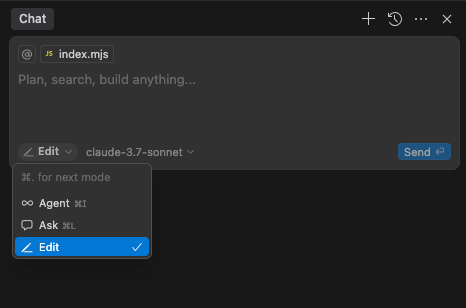

这其实反应了 AI 辅助编程的发展方向。最初的 AI 编程助手主要是被动地回答问题或提供简单的代码补全，也就是 Ask 模式，而现在正在向更主动、更智能的方向发展。 Normal 模式是 Ask 模式的增强，但仅仅是拥有了直接修改代码的能力，而 Agent 模式则更进一步，拥有了自主规划和执行的能力。

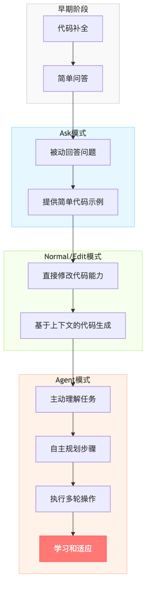

Agent 模式代表了一种更高级的交互方式，它能够：

1. **主动理解任务**：AI 不再只是回答问题，而是能够理解整个任务的上下文和目标
2. **自主规划步骤**：能够分解复杂任务，规划解决方案的步骤
3. **执行多轮操作**：可以进行多步骤的代码编写、调试和优化
4. **学习和适应**：根据用户的反馈不断调整和改进
5. **调用外部工具**：可以调用外部工具，比如 命令行，MCP

这种模式下，AI 更像是一个真正的编程助手或合作伙伴，而不仅仅是一个工具。随着大语言模型能力的不断提升，我们可以预见未来 AI 编程助手将更加智能化，能够处理更复杂的编程任务，甚至可能在某些领域达到接近人类程序员的水平。


> 所以如果你还没明白为什么有 Agent 和 Edit 两种模式，你可以直接忽略掉 Edit 模式，因为 Agent 模式已经足够强大，可以满足你大部分的需求。

我们可以通过 `cmd + I` 来快速切换到 Agent 模式，也可以通过 `cmd + L` 来快速切换到 Ask 模式。

### 代码库索引（Codebase Indexing）

在深入使用 Cursor 之前，我们需要了解代码库索引的重要性。由于当前所有大语言模型都无法直接处理整个代码库，Cursor 通过建立代码库索引来解决这一问题。这一功能使 AI 能够更全面地理解项目结构和代码关系，从而提供更精准的建议和生成更符合项目风格的代码。

索引状态可以在 `Cursor Settings` > `Features` > `Codebase Indexing` 中查看。如果系统没有自动为您的项目创建索引，您可以在此手动触发索引过程：

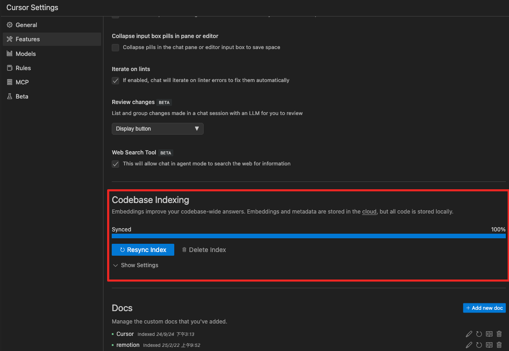

为了提高索引质量和效率，您可以创建 `.cursorignore` 文件，类似于 `.gitignore`，指定哪些文件或目录应被排除在索引之外。

> 提示：当您发现 Cursor 在 Ask 或 Agent 模式下的表现不如预期时，重新索引代码库通常能解决问题，特别是在项目结构发生较大变化后。


### 使用 Agent 模式

接下来我们会通过一个花店的项目来介绍 Agent 模式的使用过程，以及如何使用 Agent 模式来完成一个复杂的需求。并且几乎不需要手动编写代码。

我已经有一个创建好的 nextjs 项目了（当然你也可以让 Agent 帮我们创建一个 Next.js 项目），他也会调用命令行来初始化项目.

在 Agent 模式下，我们直接可以提出请求：
```
在当前nextjs项目中初始化一个花店官网，卡片化展示各种花的照片
可以点击卡片进入二级页面，展示花的详细信息
```

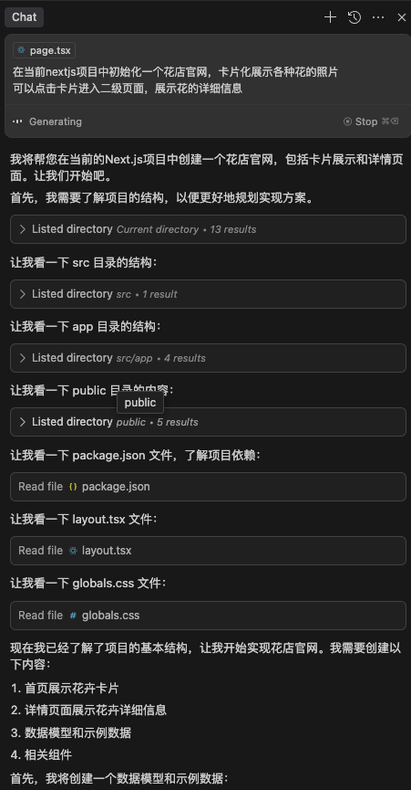
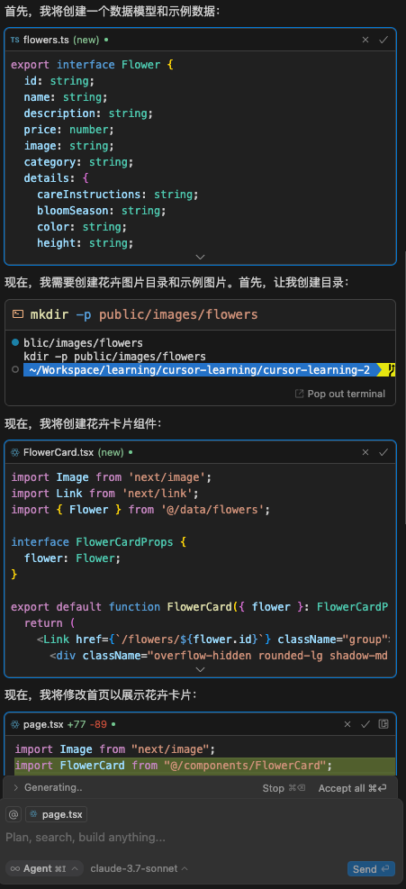
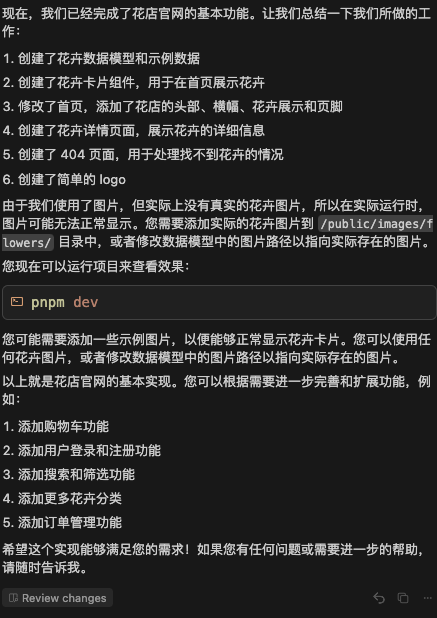

可以看到，Agent 会自动调用命令行来生成对应的路由文件夹，卡片组件，以及二级页面组件，最后还会贴心的帮我们启动 dev 服务，让我们可以预览效果。

在执行完毕之后，我们查看结果


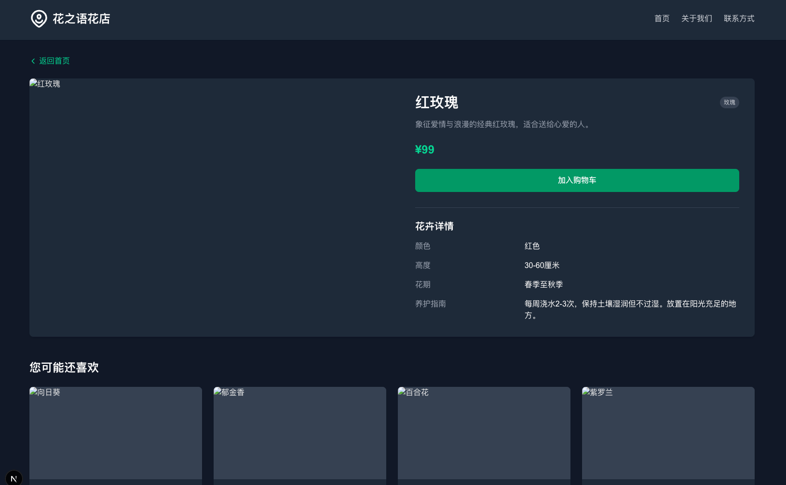

可以看到，Agent 已经帮我们生成了一个完整的花店官网，包含主页和二级页面，整体的风格也非常不错，虽然简单，但是作为一个初始项目来说也很够用了。

### Restore Checkpoint

在下一步之前，我们要保证任何的操作都是可以恢复的，而 Cursor 提供了非常方便的恢复功能，我们只需要在执行完某个操作之后，点击聊天框中的 `Restore Checkpoint` 按钮，就可以恢复到在这次请求之前的结果。

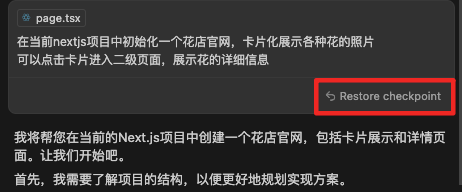

所以我们不用太担心 AI 的修改会出错，可以大胆的让 AI 帮我们修改代码。当然，为了防止 Cursor 自身的 bug 导致我们无法恢复，我们也可以用 Git 来保存我们的代码，这样即使 Cursor 出问题了，我们也可以从 Git 中恢复到之前的状态。

### Review

接下来，我们就要开始 Review 代码了

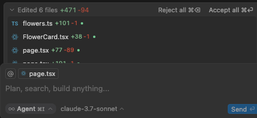

可以看到，本次 AI 生成了 6 个文件，右侧提供了两个快速处理的按钮，分别是 `Accept All` 和 `Reject All`

- Reject All 会拒绝所有修改，如果觉得 AI 的修改完全不符合需求，可以点击这个按钮
- Accept All 会接受所有修改，如果觉得 AI 的修改完全符合需求，可以点击这个按钮

但是大部份时候，我们可能需要逐个查看 AI 的修改，然后选择接受或者拒绝，这就像是我们平时在进行 Code Review 一样。需要逐行查看，然后选择接受或者拒绝。

此时进入单个页面

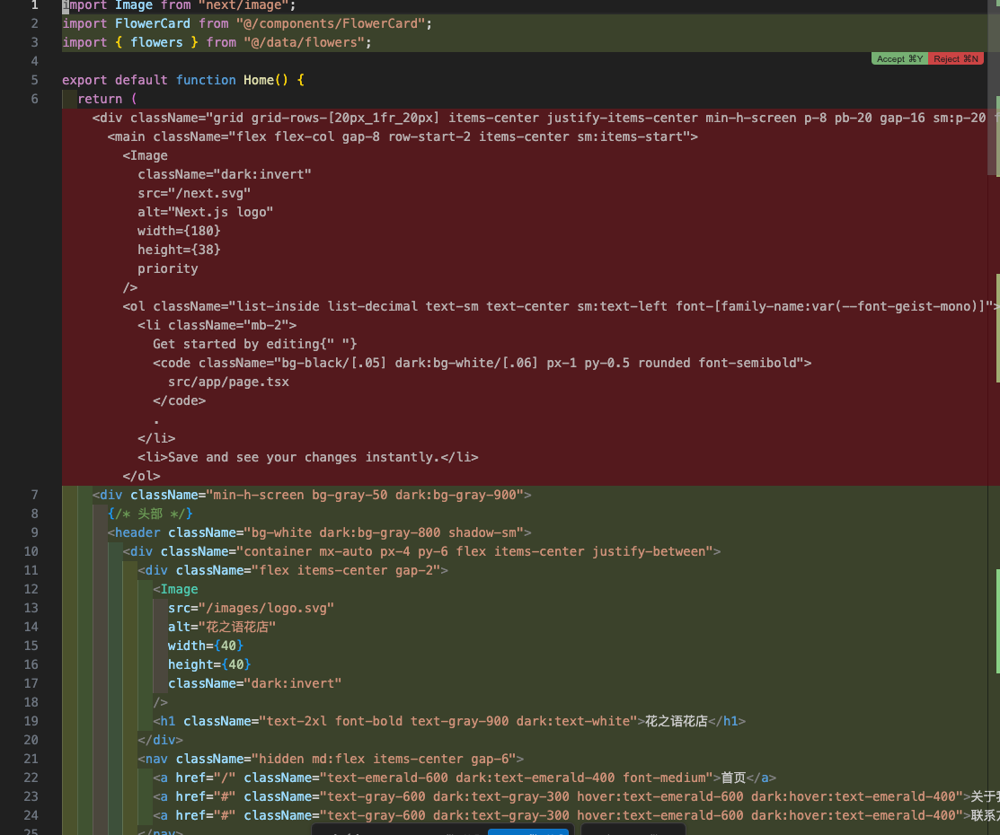

可以看到每一个部分的修改，右侧都会提醒可以 Accept 或者 Reject，我们也可以点击 `Accept` 或者 `Reject` 按钮来接受或者拒绝修改。当然我更喜欢用快捷键 `cmd + Y` 来接受修改，`cmd + N` 来拒绝修改。

当然，此时我们也可以修改 AI 的修改，比如我们觉得 AI 的修改有点问题，我们可以自己修改，然后再点击 `Accept` 按钮来接受修改。

同时在单个文件中，我们也可以用 `cmd + Enter` 来接受整个文件的修改，或者用 `cmd + Backspace` 来拒绝整个文件的修改。

最后完成所有代码的 review ，我们就算通过与 AI 协作，完成一次功能开发了，当然，其中 AI 的生成占据了大头，我们只需要进行一些微调即可。

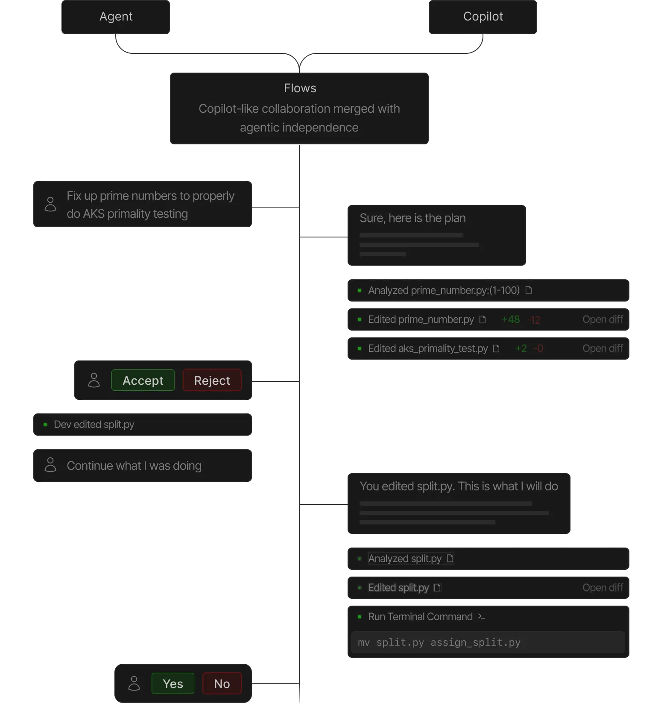

上面是一张官方的图，展示了 Agent 模式下，AI 的生成和我们的修改过程。整个流程非常清晰，即：

1. 我们提出需求
2. AI 生成代码
3. 我们进行 Review
4. 我们进行修改
5. 我们进行测试
6. 我们进行部署

接下来我们可以继续在同一个聊天框中，继续添加需求，比如我们想添加一个购物车功能，我们只需要继续输入需求即可，AI 会根据我们的需求继续生成代码。

> 需要注意，由于大模型上下文窗口的限制，如果需求过于复杂，建议新建一个聊天框，来继续添加需求。这样可以让 AI 更好地理解我们的需求。也能保证功能之间的独立性。

例如我们如果想单独修改花卉卡片，我们只需要新建一个聊天框，引用之前的花卉卡片文件，然后继续输入需求即可。

### 使用 MCP 工具

回到我们的花店网站，这里还有一个问题，就是我们没有每种花的图片，我们希望 AI 能帮我们生成一些图片，但是显然 Cursor 本身没有生成图片的能力，此时我们就可以借助 MCP 工具来生成图片。

#### 什么是 MCP 工具

MCP ，全称 [Model Context Protocol](https://modelcontextprotocol.io/)，是 Claude 推出的开源协议工具。它标准化了应用程序如何向LLMs提供上下文。将 MCP 想象成 AI 应用的 USB-C 端口。就像 USB-C 提供了一种标准化的方式将您的设备连接到各种外围设备和配件一样，MCP 提供了一种标准化的方式将 AI 模型连接到不同的数据源和工具。

简单来说，就是一个标准化的方式将 AI 模型连接到不同的数据源和工具。

我们可以在 `Cusor Settings` > `MCP` 中查看和配置 MCP 工具。

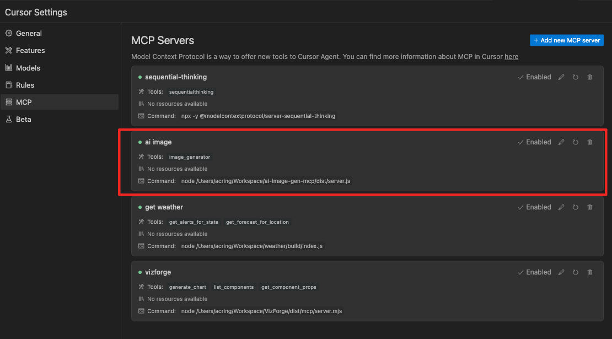

这里我已经配置好了四个 MCP 的工具，第二个工具的名称是 ai image ，就是用来生成图片的工具。

#### 使用 MCP 工具生成图片

先演示一下如何使用这个工具，首先我们来到 src/data/flowers.ts 文件，这里有所有的花卉的配置信息，
包括每个花的图片的位置，当然现在都还是没有图片的，然后我们只需要在聊天框中输入 

```
这里的 图片暂时都还没有，请调用图片生成工具，帮我把这几个图片生成出来，prompt 使用英文
```

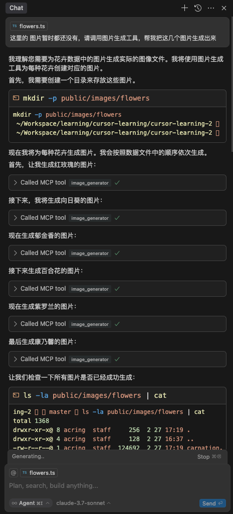

可以看到，AI 会自动识别到上下文中的图片地址，然后调用 MCP 工具来生成图片，并把图片保存到本地.


此时再看网页，可以看到图片已经生成出来了，


可以看到，通过 MCP 工具，我们将不在局限于 Cursor 本身的能力，而是可以通过各种外部工具来辅助我们完成任务。

我们可以在 [MCP 的 github 仓库](https://github.com/modelcontextprotocol/servers/tree/main) 找到关于 MCP 的很多官方例子，比如


- AWS知识库检索 - 使用Bedrock Agent Runtime进行AWS知识库检索
- Brave搜索 - 使用Brave的Search API进行网络和本地搜索
- EverArt - 使用各种模型进行AI图像生成
- Everything - 包含提示、资源和工具的参考/测试服务器
- Fetch - 网页内容抓取和转换以提升LLM使用效率
- Filesystem - 具有可配置访问控制的安全文件操作
- Git - 提供Git仓库的读取、搜索和操作工具
- GitHub - 仓库管理、文件操作和GitHub API集成
- GitLab - 支持项目管理的GitLab API
- Google云端硬盘 - Google Drive文件访问和搜索功能
- Google地图 - 位置服务、路线导航和地点详情
- Memory - 基于知识图谱的持久化记忆系统
- PostgreSQL - 支持模式检查的只读数据库访问
- Puppeteer - 浏览器自动化和网页抓取
- Sentry - 从Sentry.io检索和分析问题
- Sequential Thinking - 通过思维序列进行动态和反思性的问题解决
- Slack - 频道管理和消息传递功能
- Sqlite - 数据库交互和商业智能功能
- Time - 时间和时区转换功能

当然，自己实现一个 MCP 工具并不是一件很难的事情，特别是在 AI 的帮助之下，比如这里的 AI 图片生成工具就是我自己实现的。我还同时实现了一个绘制各种示意图的 mcp 工具，来帮助我在写文档的时候绘制各种示意图。

比如我想绘制一个流程图，我只需要在聊天框中输入：

```
帮我绘制一个流程图，展示和 AI 协作的流程
```

AI 就会主动去查找相关的组件，然后调用对应的工具来生成图片，大大提高了效率。

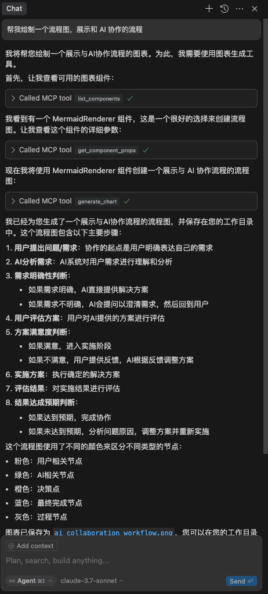

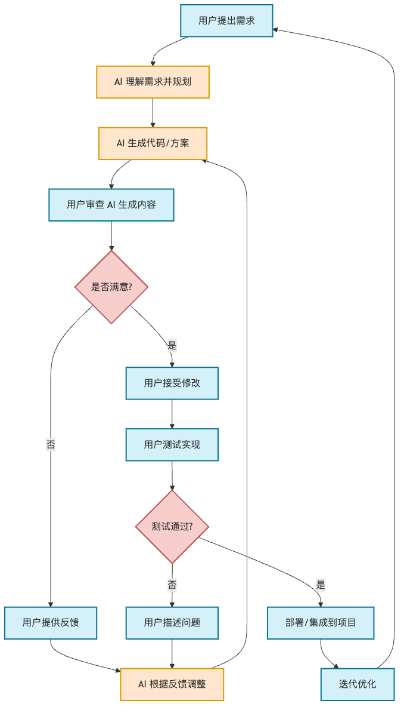

这里由于时间原因，我不过多的介绍 MCP 工具，后续可能会单开一次分享来介绍，总的来说，MCP 工具是一个非常强大的工具，将很多繁琐的步骤集成到平时的日常工作中，并利用大模型来控制比如:
- 我们可以通过 MCP 来和 Figma 文档协作，让 AI 根据 Figma 的文档来自动生成前端的业务组件。
- 我们可以通过 MCP 的 resources ，将企业内部的各种文档，比如组件库文档，产品文档，设计文档，技术文档等，集成到 AI 的上下文中，让 AI 根据这些文档来完成任务。

这里就需要靠我们的想象力了。

## 工作流

虽然我们已经完成了花店官网的初始化开发，但是如果仅仅如此，还完全打不到企业级应用的要求，我们还需要继续完善这个项目。

首先我们需要让项目更加复杂一点，我们将花卉的数据配置继续拆分

```
将配置进行拆分，花的主要信息和花的详情展示按不同的花，单独放置，src/data/flowers/flowerBasics.ts 文件中放置主要信息，src/data/flowers/flowerDetails.ts 文件中放置详情信息，最后整合在一起
```

这样，项目的复杂度稍微大了一点，在这种情况下，假如我们需要新增一种花，该怎么办？

即使省去详细的数据，我们也需要这样告诉 AI
```
新增一种花，先叫玫瑰，然后生成一张玫瑰的图片，然后在 src/data/flowers/flowerBasics.ts 文件中新增一种花的配置，然后在 src/data/flowers/flowerDetails.ts 文件中新增一种花的详情配置

```

当项目变得复杂之后，每个需求涉及到的代码和目录越来越多，如果每次都需要手动编写，那么效率会非常低。

我们可以用 project rule 来告诉 AI ，我们希望它如何完成这个需求。即定义我们的工作流。


## Project Rule

### 用 Project Rule 定义工作流
Project Rule 是 Cursor 提供的一种项目级别规范，比如定义项目中代码的规范，或者定义项目中的一些约定俗成的规范。

但是不要被 Project Rule 的名称所迷惑，Project Rule 不仅仅局限于代码规范，还可以定义项目中的工作流。

我们先来创建一个 Project Rule，来告诉 AI ，我们希望它如何完成这个需求。

通过按下 shift + cmd + P ，然后输入 `Project Rule` ，然后选择 `Create New Rule` ，然后输入规则的名称，名称通常不是很重要。比如这里叫 add-flower

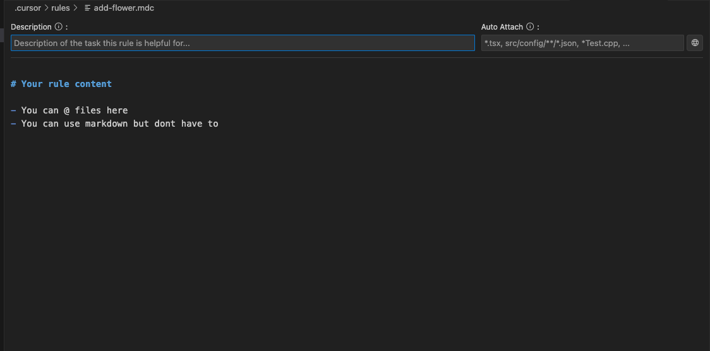

可以看到 rule 有三个部分，分别是：

- Description
- Auto Attach 
- 正文


Description 这个名称也非常的具有迷惑性，似乎是想描述这个规范，但查看官方文档，会发现他的作用是:
The agent can see this description and decide to read the full rule if it wants it.If no description is provided we will only use the attach rules below.

翻译过来就是：

> 如果提供了描述，那么 AI 会根据描述来决定是否阅读完整的规则。如果没有任何描述，那么 AI 只会使用下面的规则。

意思就是，如果 AI 根据描述觉得用户的需求符合描述，那么 AI 就会阅读完增的 rule，所以我们可以这么写

Description: 

当用户需要新增一种花的时候，请按照以下步骤执行：

正文:

1. 根据花的名称，生成一张花的近景特写，prompt 使用英文
2. 在 src/data/flowers/flowerBasics.ts 文件中新增一种花的配置
3. 在 src/data/flowers/flowerDetails.ts 文件中新增一种花的详情配置

那么当用户提出需求的时候，AI 就会按照这个规则来执行。我们可以试试效果

只需要输入，想添加一个荷花，这里我们甚至不需要任何的上下文，也不需要主动引用规则

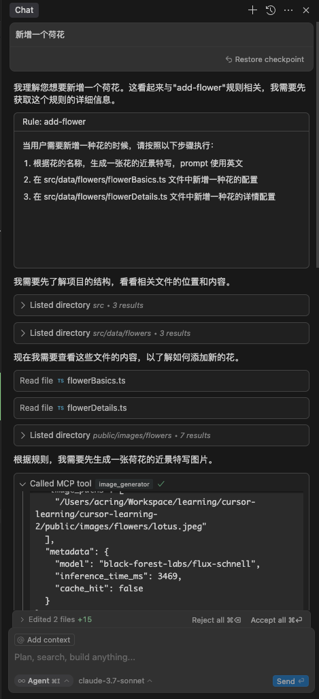

可以看到, AI 根据我的描述，识别到了我的意图，并根据 Project Rule 中对于新增花的意图的后续行为，自动执行了所有的步骤，这样，我们只需要提供一个工作流的模版，和对应的意图描述，AI 就可以自动执行所有的步骤，大大提高了效率。

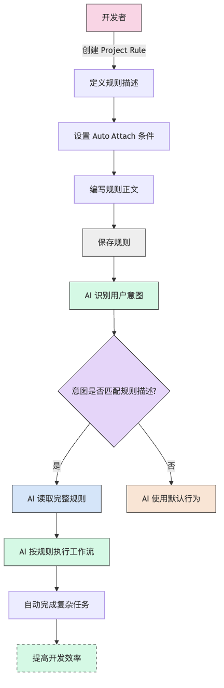

> 虽然不指定工作流时 Agent 也能自动查找相关文件进行修改，但不同编辑器对项目上下文的处理机制存在差异（例如 WindSurf 具备更优秀的上下文理解能力）。这种依赖编辑器工程化处理能力的方式存在不稳定性，因此建议通过明确的工作流规范来约束 AI 行为。这种主动定义工作流的方式不仅能提升任务执行的准确性，也更符合企业级开发的规范化要求。

> 另一方面来说，定义工作流不仅仅能提升任务执行的准确性，也能让新加入的成员快速上手，因为工作流是写在项目中的，所以新成员只需要查看工作流，就能快速上手。而减少在开发过程中理解不同导致的修改遗漏。


### 用 Project Rule 定义代码规范

Project Rule 不仅仅能定义工作流，还能定义代码规范。这也是更加传统的使用方式，这需要用到 `Auto Attach` 功能。他的描述是 

When you specify file patters here (e.g.*.py or clienttsx),this rule will
automatically be included in Al responses for files matching those patterns

翻译过来就是：

当您在此处指定文件模式（例如 *.py 或 clienttsx）时，此规则将自动包含在匹配这些模式的文件的 AI 响应中。

比如说，我们新建一个组件文件的规范 component.mdc:

```
globs: src/components/*.tsx
## 组件规范

1. 需要在组件头部添加注释，描述组件功能
2. 需要有 className 属性，传入根元素
3. 使用 memo 包裹组件，避免不必要的渲染
4. 添加了 displayName 属性，便于在 React 开发工具中识别组件
```

这样，我们在使用 Agent 的时候，假如引用的文件符合 globs 的规则，那么 AI 就会自动按照这个规则来执行。

比如我们要求，优化组件代码，那么 AI 就会自动按照这个规则来优化代码。


但是需要注意，必须是在引用文件匹配的情况下，AI 才会根据这个规则来执行。

如果只是生成的文件符合 globs 的规则，那么 AI 不会自动按照这个规则来执行

比如，我们要求修改 src/components/flower-card.tsx 文件，那么 AI 就会自动按照这个规则来执行。但是如果我们说，在 src/components 新增一个 xxx 组件，那么 AI 不会自动根据 globs 来匹配规范。

> 通过测试，在 0.45 中， cursor 是能看到 globs 的规则的，但是 0.46 中， cursor 是看不到 globs 的规则的，所以导致了这个问题。不知道后续版本会不会优化这个问题。
> 并且，在 0.46 中，即使我们在工作流中要求遵循某一个规范， 也大概率会被忽略掉，这也是 cursor 的 bug，希望后续版本会修复这个问题


此时还是需要依靠 Description 来告诉 AI ，什么时候可以执行这个规则。所以我们需要在 Description 中告诉 AI ，这是一个通用组件规范。

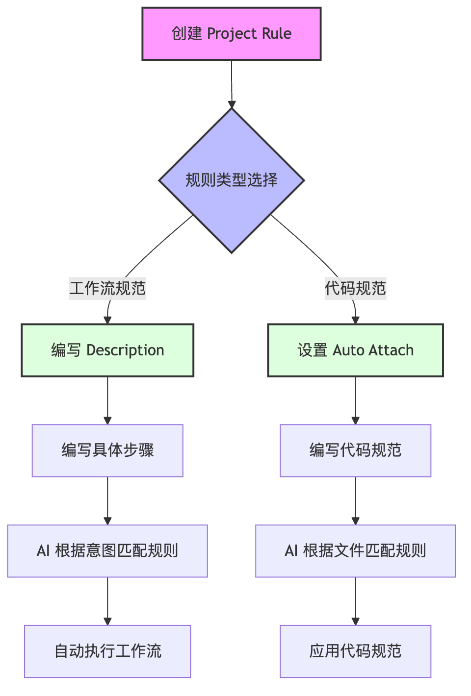

## Agent 小结

现在我们通过 Agent 模式，已经可以完成一个复杂的需求了，并且几乎不需要手动编写代码。
我们用自然语言描述需求，AI 会自动生成代码，我们只需要进行 Review 和修改即可。
在项目逐步增长之后，我们还可以通过 Project Rule 来定义常见工作流和代码规范，让 AI 按照我们定义的规则来快速完成通用任务。
遇到复杂的需求，我们还可以通过 MCP 工具来调用外部工具，比如图片生成，视频生成，读取外部文件等。

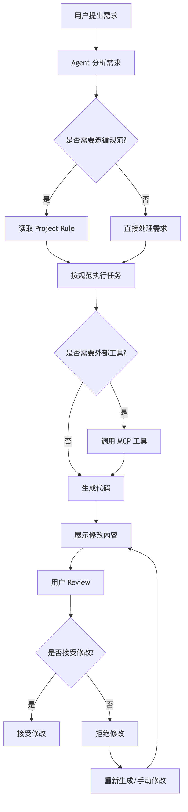

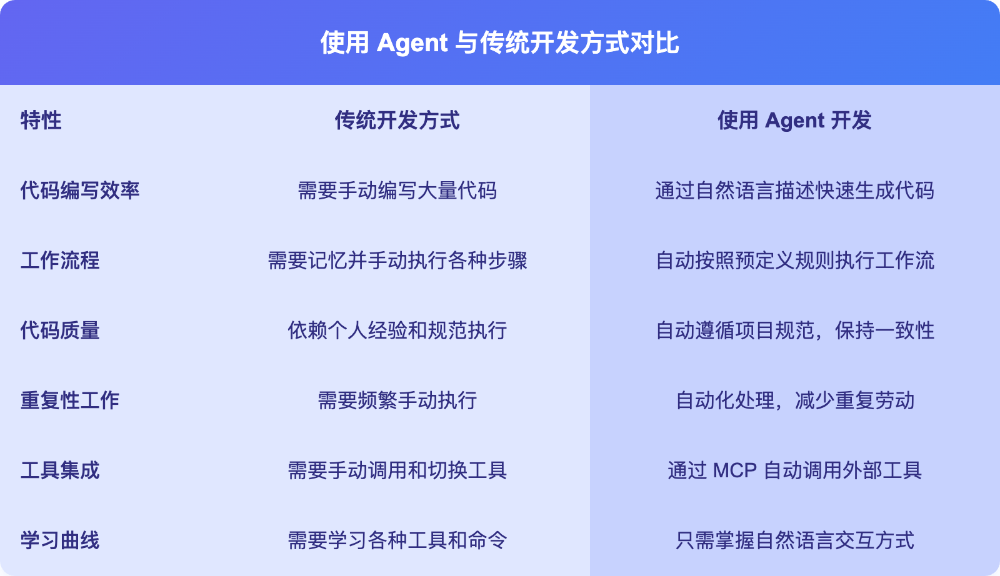


## 该使用哪款大模型

根据 [Claude 3.7 Sonnet 的发布](https://www.anthropic.com/news/claude-3-7-sonnet)，Claude 3.7 Sonnet 在编码和前端网页开发方面表现出特别显著的改进。


- 在代码编辑方便，无脑选择 Claude 3.7 Sonnet
- 在文字编码，特别是中文编码方面，还是可以选择 deepseek r1.