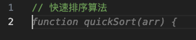
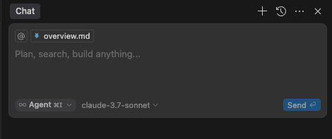
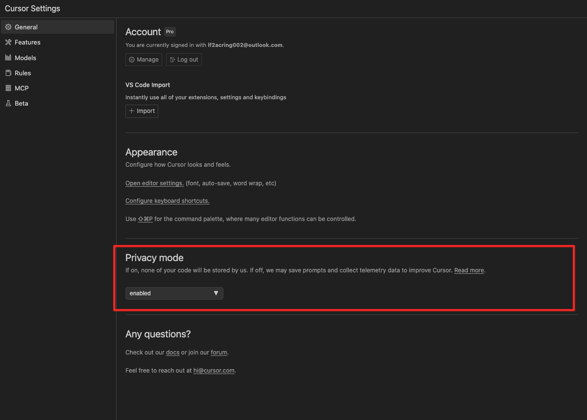

## 背景

随着各种工具的发展， AI 编程已经从好不好用的争论编程了，用哪个好，怎么用的争论，说明 AI 编程实际上已经成为程序开发中无法跳过的一个部分，不管是对于年轻的程序员还是经验丰富的程序员，尽快拥抱 AI 编程才是正确的道理，本教程就是从 cursor 的基础操作到高级功能，到更详细的最佳实践和案例，说明如何正确的时候 AI 编程，来达到我们的将本增效的期望，把程序员从搬砖中抽离出来，去完成更多具有创意性的工作。

## 下载安装

在 https://www.cursor.com/ 官网进行下载，下载后安装，目前最新的版本是 0.46.* ，带来了许多新的功能，比如：
- UI 更新，将 Agent 作为默认界面
- MCP 工具改进

官网暂时没有提供下载，需要通过其他渠道下载，比如：
windows: https://anysphere-binaries.s3.us-east-1.amazonaws.com/production/aff57e1d9a74ed627fb5bd393e347079514436a7/win32/x64/user-setup/CursorUserSetup-x64-0.46.0.exe
mac(intel): https://anysphere-binaries.s3.us-east-1.amazonaws.com/production/aff57e1d9a74ed627fb5bd393e347079514436a7/darwin/x64/Cursor-darwin-x64.zip
mac(apple): https://anysphere-binaries.s3.us-east-1.amazonaws.com/production/aff57e1d9a74ed627fb5bd393e347079514436a7/darwin/arm64/Cursor-darwin-arm64.zip


## 从 VS Code 迁移

Cursor 本质上是 VS Code 开源版本的分支，所以可以非常简单的进行迁移，可以通过一键导入将 VS Code 配置导入到 Cursor 中。进入 Cursor 设置 > 常规 > 账户。

Cursor 没有用插件的方式来扩展 VS Code ，是为了Cursor 可以更好地控制编辑器的 UI，从而实现更深度的 AI 集成。像 Cursor Tab 和 CMD-K 这样的功能，作为现有编程环境中的插件是无法实现的。


⚠️ 需要注意的是，Cursor 本身没有自动同步插件的功能，所以如果你有在不同设备上使用 Cursor ，需要手动同步插件，或者在安装插件的时候，去 vscode 的插件市场安装。
这样就都可以在不同设备上使用相同的插件了。


## Tab 自动补全

注册登陆成功之后，我们可以创建一个 `index.js` 文件，**然后输入注释**

```jsx
// 快速排序算法

```

然后回车，cursor 就会在下一行自动用灰色补全出函数名称，此时按下 tab

cursor 就会自动补全出完整的快速排序算法代码。这个功能不仅支持算法，还支持各种常见的代码片段和函数实现。你可以通过继续输入注释来让 cursor 生成更多的代码。



按下 tab 之后，cursor 则会继续展示剩余可以补全的部分


只需要再次按下 tab 就可以写完整个函数了

## 简单编辑

选中整个函数，按下 command + k ，可以打开快速编辑弹窗，输入要求，可以让 AI 帮忙编辑选中部分的代码（注意要选中整个函数， cmd + k 只会编辑选中部分的代码）


这里，cursor 就帮我们简化了函数的写法，点击 Accept 按钮，或者直接 cmd + enter ，即可接受修改，或者用 cmd + backspace 来取消修改

## Chat

我们可以用 `cmd + L` 打开聊天框，来向 AI 询问关于代码的问题，或者直接当作助手聊天



`cmd + L` 会默认将当前编辑文件作为上下文，也可以选择其他文件作为上下文

## private mode



cursor 支持开启隐私模式,启用**`隐私模式`**后，Cursor 或任何第三方将永远不会存储您的任何代码。否则，可能会收集提示、代码片段和遥测数据以改进 Cursor。

可以在载入时或在 **`Cursor Settings`** > **`General`** > **`Privacy Mode（常规`**）下启用**`隐私模式`**。

## **Generate Commit Message**


在 `git add` 代码之后，可以点击打开侧边栏中的 Git 选项卡，查找提交消息输入字段旁边的 ✨ 图标，点击后会根据暂存的更改生成提交消息

```jsx
Add sorting algorithms and utility functions

- Introduced quickSort function in index.js for efficient sorting.
- Added bubbleSort function and a simple add function in other.js.
- Created .gitignore to exclude .history files.
```

但是目前，没有办法自定义或提供有关如何生成提交消息的具体说明。AI 将自动适应您现有的提交消息样式。

所以功能的可用性还有待加强